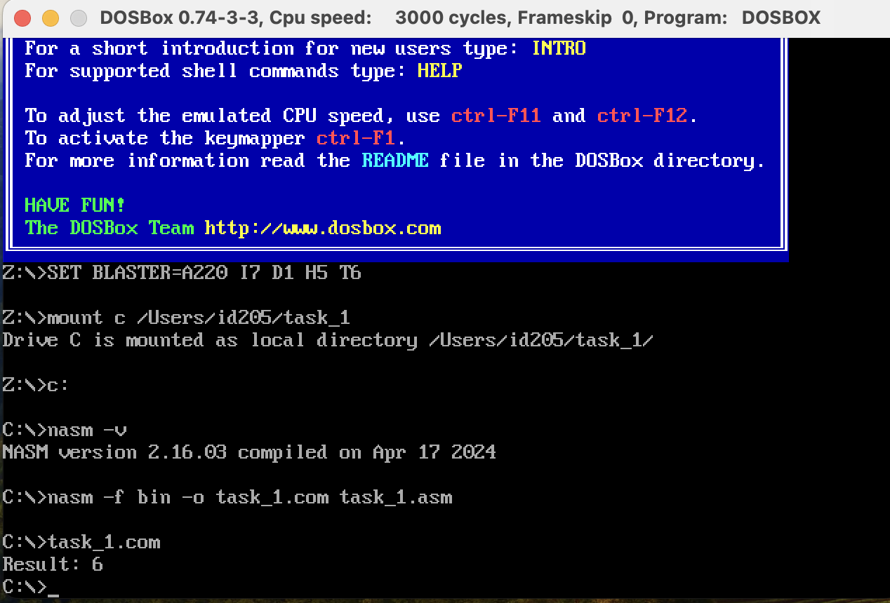

# goit-cs-hw-01

## Завдання 1

Розробіть програму на асемблері, яка виконує обчислення арифметичного виразу b - c + a.

Використовуйте як основу приклад програми для обчислення a + b - c, представлений у конспекті (посилання на папку репозиторію до конспекту), але з необхідними модифікаціями для вирішення цього завдання.


Покрокова інструкція

1. Вивчіть код програми, що обчислює a + b - c, наведений у конспекті.

2. Модифікуйте програму так, щоб вона виконувала обчислення за формулою b - c + a.

3. Після внесення змін у код скомпілюйте та запустіть програму, щоб перевірити, чи коректно вона обчислює вираз b - c + a.

4. Ваша програма повинна виводити результат обчислення на екран.

5. Після запуску програми у DOSBox зробіть скріншот вікна DOSBox із відображеним результатом виконання вашої програми.


**Для запуску скрипту у DOSBox терміналі:**
```
nasm -f bin -o task_1.com task_1.asm
task_1.com
Result: 6
```

